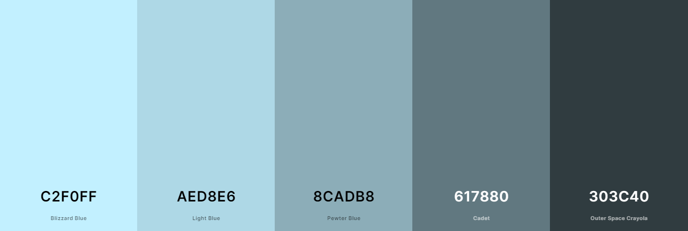
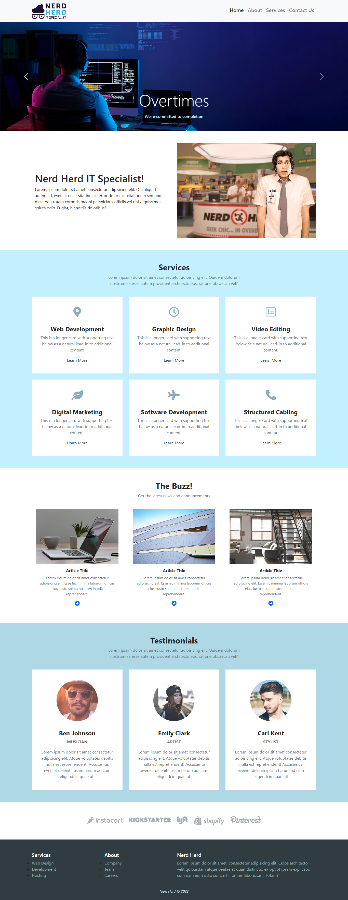
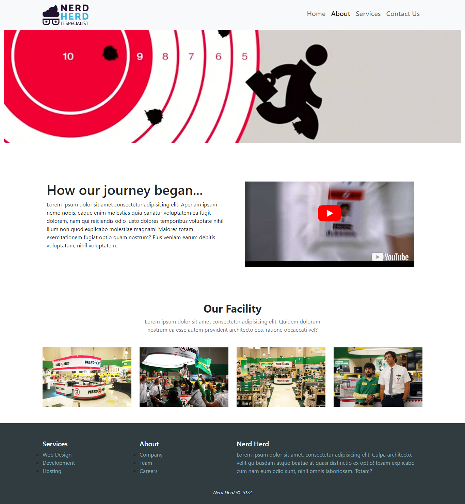
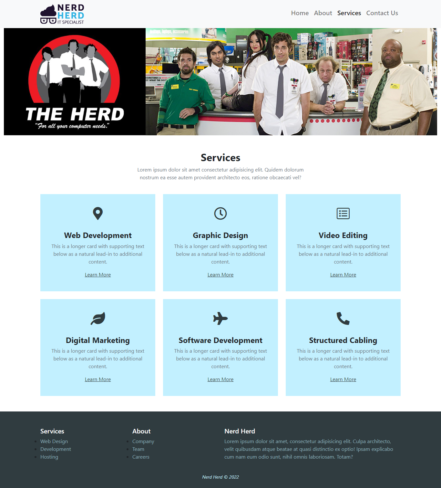
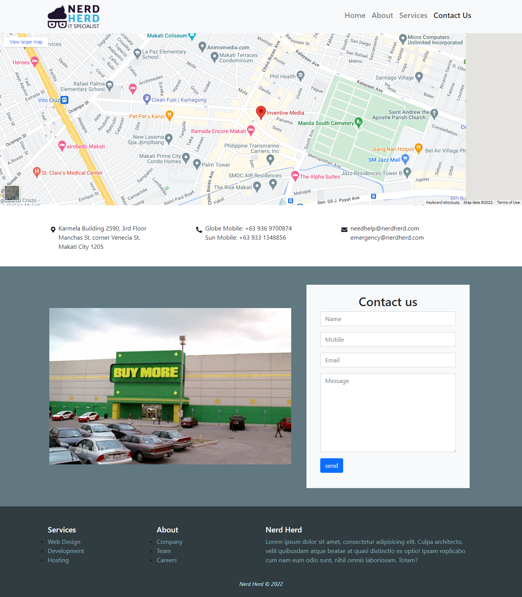

# Front-end Style Guide

## Table of Contents

- [Colors](#colors)
- [Icons](#icons)
- [Layout](#layout)
  - [Home](#home)
  - [About](#about)
  - [Services](#services)
  - [Contact](#contact)
- [Initializing Your Project](#initializing-your-project)

## Colors



- Blizzard Blue: #c2f0ff
- Light Blue: #aed8e6
- Pewter Blue: #8cadb8
- Cadet: #617880
- Outer Space Crayola: #303c40

[Back to Top](#front-end-style-guide)

## Icons

Web Development
```html
<i class="bi bi-laptop display-1"></i>
```

Graphic Design
```html
<i class="bi bi-palette display-1"></i>
```

Video Editing
```html
<i class="bi bi-camera-reels-fill display-1"></i>
```

Digital Marketing
```html
<i class="bi bi-graph-up-arrow display-1"></i>
```

Software Development
```html
<i class="bi bi-window-desktop display-1"></i>
```

Structured Cabling
```html
<i class="bi bi-cone-striped display-1"></i>
```

[Back to Top](#front-end-style-guide)

## Map

```html
<iframe src="https://www.google.com/maps/embed?pb=!1m18!1m12!1m3!1d3861.5768687626414!2d121.01169321519552!3d14.566172981823657!2m3!1f0!2f0!3f0!3m2!1i1024!2i768!4f13.1!3m3!1m2!1s0x3397c9a04480d30b%3A0xeb58a3874cff7c5d!2sInventive%20Media!5e0!3m2!1sen!2sph!4v1676263072653!5m2!1sen!2sph" width="1920" height="600" style="border:0;" allowfullscreen="" loading="lazy" referrerpolicy="no-referrer-when-downgrade"></iframe>
```

[Back to Top](#front-end-style-guide)

## Layout

### Home


[Back to Top](#front-end-style-guide)

### About


[Back to Top](#front-end-style-guide)

### Services 


[Back to Top](#front-end-style-guide)

### Contact 


The designs were created to the following widths:

- Mobile: 500px
- Desktop: 1366px

[Back to Top](#front-end-style-guide)

## Initializing Your Project

1. Create your `index.html`

    - Inside it initialize your boilerplate structure with the `!` mark
    - Then name your page `<title>`
    - Add your `link:favicon` below it
    - Then a `link` to your `"./css/style.css"` custom stylesheet below it

2. Link Bootstrap

    - Add a `link` to `"./css/bootstrap.css"` right above your custom stylesheet below it
    - Then add a `script:src` to `"./js/bootstrap.bundle.js"` right before the closing `</body>` tag

3. Create your `#regions` in the `<body>` for easy organization

4. Initialized Project HTML Sample:

    ```html
    <!DOCTYPE html>
    <html lang="en">
    <head>
      <meta charset="UTF-8">
      <meta http-equiv="X-UA-Compatible" content="IE=edge">
      <meta name="viewport" content="width=device-width, initial-scale=1.0">

      <title>Nerd Herd | Home</title>
      <link rel="shortcut icon" href="./img/nerd-herd-icon.jpg" type="image/x-icon">

      <link rel="stylesheet" href="./css/bootstrap.css">
      <link rel="stylesheet" href="./css/style.css">
    </head>
    <body>
        <!-- #region Header -->
        <header>
            
            <!-- #region Primary Navigation -->
            
            <!-- #endregion Primary Navigation -->

        </header>
        <!-- #endregion Header -->

        <!-- #region Main -->
        <main>

            <!-- #region Slider -->
            <div>
      
            </div>
            <!-- #endregion Slider -->

            <!-- #region Hero -->
            <section>

            </section>
            <!-- #endregion Hero -->
    
        </main>
        <!-- #endregion Main -->

        <!-- #region Footer -->
        <footer>

        </footer>
        <!-- #endregion Footer -->
      
        <script src="./js/bootstrap.bundle.js"></script>
    </body>
    </html>
    ```

[Back to Top](#front-end-style-guide)